# Rust AI Ollama Client

A comprehensive Rust application for interacting with Ollama AI models, featuring both local and remote server connectivity, image analysis capabilities, and real-time streaming responses with performance metrics.

## 🚀 Features

- **Multi-Connection Support**: Connect to both local and remote Ollama servers
- **Interactive Menu System**: Easy-to-use command-line interface
- **Image Analysis**: Analyze images using vision models (llava)
- **Real-time Streaming**: Stream responses with live performance metrics
- **Performance Monitoring**: Track tokens per second, response times, and throughput
- **Flexible Configuration**: Environment-based configuration with `.env` support
- **Command Line Interface**: Direct command execution with arguments
- **Server Fallback**: Automatic fallback from remote to local connections

## 📋 Prerequisites

- **Rust** (latest stable version)
- **Ollama** installed and running
- **Vision Model** (optional, for image analysis): `ollama pull llava`


## Architecture Diagram of this project

```mermaid
graph TB
    %% Main Entry Point
    CLI[main.rs<br/>CLI Application] --> Parser[clap::Parser<br/>--prompt, --test, --local, --image]
    
    %% Core Modules
    CLI --> Remote[connecttoollama.rs<br/>Remote Server Connection]
    CLI --> Local[connectlocally.rs<br/>Local Server Connection]
    CLI --> Vision[imagedescriber.rs<br/>Image Analysis]
    
    %% Menu System
    CLI --> Menu{Interactive Menu}
    Menu --> M1[1. Remote Generation]
    Menu --> M2[2. Local Generation]
    Menu --> M3[3. Test Remote]
    Menu --> M4[4. Test Local]
    Menu --> M5[5. View Config]
    Menu --> M6[6. Analyze Image]
    Menu --> M7[7. Exit]
    
    %% Remote Module Functions
    Remote --> RemoteGen[generate_response]
    Remote --> RemotePrompt[generate_with_prompt]
    Remote --> RemoteTest[test_connection]
    
    %% Local Module Functions
    Local --> LocalGen[generate_response]
    Local --> LocalPrompt[generate_with_prompt]
    Local --> LocalTest[test_connection]
    Local --> LocalList[list_models]
    
    %% Vision Module Functions
    Vision --> VisionAnalyze[analyze_image]
    Vision --> VisionSpecific[analyze_specific_image]
    Vision --> VisionTest[test_vision_model]
    Vision --> VisionCore[analyze_image_with_prompt]
    
    %% External Dependencies
    ENV[.env file<br/>server_ip, model, vision_model] --> Remote
    ENV --> Local
    ENV --> Vision
    
    Images[./images/ directory<br/>jpg, png, gif, etc.] --> Vision
    
    %% Ollama Servers
    RemoteServer[Remote Ollama Server<br/>http://server_ip:11434] --> Remote
    RemoteServer --> Vision
    
    LocalServer[Local Ollama Server<br/>http://localhost:11434] --> Local
    LocalServer --> Vision
    
    %% Ollama-rs Library
    OllamaLib[ollama-rs crate<br/>Ollama, GenerationRequest, Image] --> Remote
    OllamaLib --> Local
    OllamaLib --> Vision
    
    %% Data Flow
    M1 --> RemoteGen
    M2 --> LocalGen
    M3 --> RemoteTest
    M4 --> LocalTest
    M5 --> Config[Display Configuration]
    M6 --> VisionAnalyze
    
    %% Fallback Logic
    Vision -.->|Fallback| LocalServer
    Vision --> Fallback{Remote Failed?}
    Fallback -->|Yes| LocalServer
    Fallback -->|No| RemoteServer
    
    %% Performance Metrics
    RemoteGen --> Metrics[Performance Metrics<br/>Tokens/sec, Timing]
    LocalGen --> Metrics
    VisionCore --> Metrics
    
    %% Streaming Responses
    RemoteGen --> Stream[Streaming Output<br/>Real-time token display]
    LocalGen --> Stream
    VisionCore --> Stream
    
    %% Image Processing
    Vision --> ImageList[list_images]
    Vision --> ImageLoad[create_image_from_file]
    Vision --> Base64[Base64 encoding]
    
    %% Darker styling for better text contrast
    style CLI fill:#1565c0,stroke:#0d47a1,stroke-width:2px,color:#ffffff
    style Remote fill:#6a1b9a,stroke:#4a148c,stroke-width:2px,color:#ffffff
    style Local fill:#2e7d32,stroke:#1b5e20,stroke-width:2px,color:#ffffff
    style Vision fill:#ef6c00,stroke:#bf360c,stroke-width:2px,color:#ffffff
    style ENV fill:#388e3c,stroke:#1b5e20,stroke-width:2px,color:#ffffff
    style Images fill:#388e3c,stroke:#1b5e20,stroke-width:2px,color:#ffffff
    style RemoteServer fill:#5d4037,stroke:#3e2723,stroke-width:2px,color:#ffffff
    style LocalServer fill:#5d4037,stroke:#3e2723,stroke-width:2px,color:#ffffff
    style OllamaLib fill:#455a64,stroke:#263238,stroke-width:2px,color:#ffffff
    
    classDef moduleClass fill:#37474f,stroke:#263238,stroke-width:2px,color:#ffffff
    classDef menuClass fill:#424242,stroke:#212121,stroke-width:2px,color:#ffffff
    classDef functionClass fill:#546e7a,stroke:#37474f,stroke-width:2px,color:#ffffff
    classDef flowClass fill:#795548,stroke:#5d4037,stroke-width:2px,color:#ffffff
    
    class Remote,Local,Vision moduleClass
    class Menu,M1,M2,M3,M4,M5,M6,M7 menuClass
    class RemoteGen,RemotePrompt,RemoteTest,LocalGen,LocalPrompt,LocalTest,LocalList,VisionAnalyze,VisionSpecific,VisionTest,VisionCore functionClass
    class Metrics,Stream,Config,ImageList,ImageLoad,Base64,Fallback flowClass
```


## 🛠️ Installation

1. **Clone the repository:**
   ```bash
   git clone https://github.com/Not-Buddy/Rust-AI-Ollama.git
   cd Rust-AI-Ollama
   ```

2. **Set up environment variables:**
   ```bash
   cp .envexample .env
   ```
   
   Edit `.env` with your configuration:
   ```env
   server_ip=your.server.ip.address
   model=llama3.2
   vision_model=llava
   ```

3. **Create images directory:**
   ```bash
   mkdir images
   ```
   Add your images (jpg, jpeg, png, gif, bmp, webp) to this directory for analysis.

4. **Build the application:**
   ```bash
   cargo build --release
   ```

## 🚀 Usage

### Interactive Menu

Launch the interactive menu:
```bash
cargo run
```

**Menu Options:**
1. **Generate Response (Remote Server)** - Connect to configured remote server
2. **Generate Response (Local)** - Use local Ollama instance
3. **Test Server Connection** - Test remote server connectivity
4. **Test Local Connection** - Test local Ollama connectivity
5. **View Configuration** - Display current settings
6. **Analyze Image** - AI-powered image analysis
7. **Exit** - Close application

### Command Line Interface

**Direct text generation:**
```bash
cargo run -- --prompt "Explain quantum computing"
```

**Use local instance:**
```bash
cargo run -- --local --prompt "What is Rust programming?"
```

**Test connections:**
```bash
cargo run -- --test
```

**Analyze specific image:**
```bash
cargo run -- --image photo.jpg
```

## 📁 Project Structure

```
Rust-AI-Ollama/
├── src/
│   ├── main.rs              # Main application and menu system
│   ├── connecttoollama.rs   # Remote server connection logic
│   ├── connectlocally.rs    # Local Ollama connection logic
│   └── imagedescriber.rs    # Image analysis functionality
├── images/                  # Directory for image analysis
├── .env                     # Environment configuration
├── .envexample             # Example environment file
├── Cargo.toml              # Dependencies and project metadata
└── README.md               # This file
```

## ⚙️ Configuration

### Environment Variables

The `.env` file supports the following variables:

```env
# Remote server configuration
server_ip=192.168.1.100          # Your Ollama server IP
model=llama3.2                   # Default text model
vision_model=llava               # Model for image analysis
```

### Supported Image Formats

- JPEG/JPG
- PNG
- GIF
- BMP
- WebP

## 📊 Performance Metrics

The application provides detailed performance analytics:

- **Total Response Time**: End-to-end request duration
- **Tokens Generated**: Number of tokens in response
- **Tokens per Second**: Real-time throughput measurement
- **Server Metrics**: Ollama-reported evaluation times and speeds

## 🔧 Dependencies

Key dependencies include:

```toml
[dependencies]
ollama-rs = "0.3.2"           # Ollama API client
tokio = "1.0"                 # Async runtime
tokio-stream = "0.1"          # Stream utilities
clap = "4.0"                  # Command line parsing
dotenv = "0.15"               # Environment variables
base64 = "0.22"               # Image encoding
```

## 🚀 Advanced Usage

### Server Priority

The application follows this connection priority:
1. **Remote Server** (if configured in `.env`)
2. **Local Fallback** (automatic if remote fails)

### Image Analysis Workflow

1. Place images in the `./images/` directory
2. Select "Analyze Image" from menu or use `--image filename`
3. Choose image from numbered list
4. Enter custom prompt or use default
5. View AI analysis with performance metrics

### Custom Prompts for Images

```bash
# Use custom prompt for image analysis
cargo run -- --image nature.jpg
# Then enter: "Identify all the animals in this image"
```

## 🤝 Contributing

1. Fork the repository
2. Create a feature branch: `git checkout -b feature-name`
3. Make your changes and commit: `git commit -m 'Add feature'`
4. Push to branch: `git push origin feature-name`
5. Submit a pull request

## 📝 License

This project is open source. See the repository for license details.

## 🆘 Troubleshooting

### Common Issues

**Connection Refused:**
```bash
# Check if Ollama is running
ollama serve

# Test connection
curl http://localhost:11434
```

**Missing Models:**
```bash
# Pull required models
ollama pull llama3.2
ollama pull llava
```

**Environment Variables:**
- Ensure `.env` file exists and contains valid configuration
- Check that `server_ip` is accessible from your network

### Performance Tips

- Use local instance for faster response times
- Configure appropriate models for your hardware
- Monitor token generation rates to optimize performance

## 📞 Support

For issues or questions:
- Open an issue on GitHub
- Check existing issues for solutions
- Review the troubleshooting section

**Built with ❤️ in Rust | Powered by Ollama**
